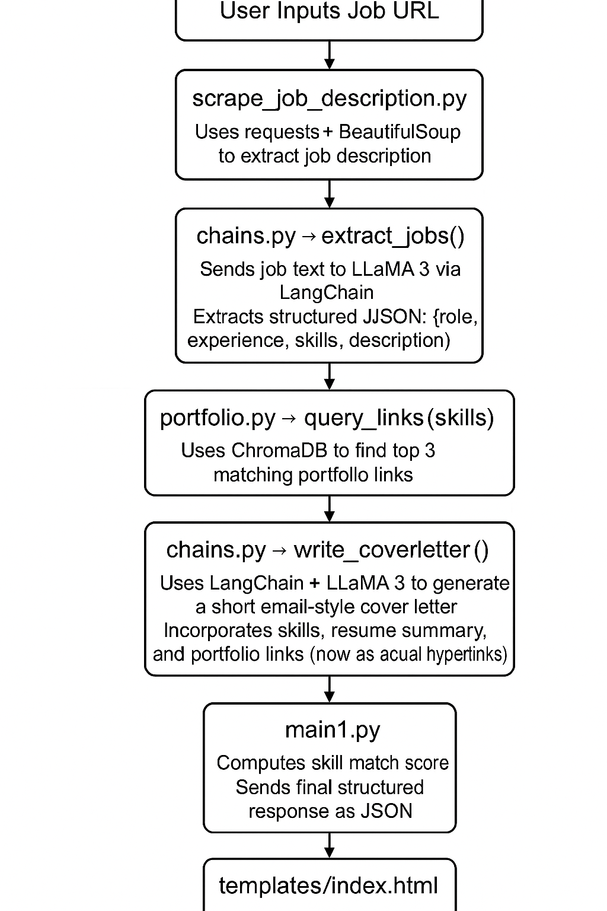

# 🤖 SmartCover: AI-Powered Cover Letter Generator with Resume & Portfolio Matching (AWS Deployable)

Generate personalized cover letters from job postings using LLaMA 3, LangChain, and ChromaDB. Automatically match your resume to job descriptions, retrieve relevant portfolio links, and deploy it all via Flask on AWS EC2.

---

## 🚀 Features

- 🔍 **Job Scraper**: Scrapes job descriptions from URLs using BeautifulSoup
- 🧠 **LLM-Powered Extraction**: Uses Groq-hosted LLaMA 3 via LangChain to extract structured job data
- ✍️ **Cover Letter Writer**: Generates a short, professional email-style cover letter with portfolio matching using your resume and the job info
- 🔗 **Portfolio Matching**: Uses ChromaDB to retrieve relevant project links based on job-required skills
- 📊 **Skill Match Score**: Calculates how closely your resume matches the job
- 🌐 **Modern UI**: Flask + Bootstrap frontend with clean layout
- ☁️ **Deployed on AWS EC2**: Served via Gunicorn, NGINX, and secured with HTTPS using Let's Encrypt

---

## 📌 Note on Personalization

This version of the project is personalized for the original developer (Saketh), with:
- A static resume file (`resource/my_resume.txt`)
- A static portfolio CSV (`resource/my_portfolio.csv`)

📦 However, this project **can be easily extended** into a multi-user platform by:

- Adding a **resume upload UI** (file input)
- Allowing users to **upload their portfolio CSV**
- Storing user data temporarily (in-memory or database)

This would allow **any user to generate their own tailored cover letter** using their own information — making it a fully usable public tool.

---

## 🏗️ Tech Stack

- **Python 3.10**
- **Flask** for web backend
- **LangChain** for LLM prompt chaining
- **Groq + LLaMA 3 (70B)** for language generation
- **ChromaDB** for semantic portfolio link search
- **BeautifulSoup + requests** for scraping
- **Bootstrap 5** for frontend styling
- **Gunicorn + NGINX** for production serving
- **systemd** for auto-start service management

---
## 🔁 Workflow Flowchart

Below is a visual representation of the process:

<p>
  
</p>

```
## 📁 Project Structure

```
smartcover/
├── app/
│   ├── chains.py                    # LangChain prompts & Groq logic
│   ├── portfolio.py                 # Portfolio link matching using ChromaDB
│   ├── scrape_job_description.py    # Job scraping with BeautifulSoup
│   ├── templates/
│   │   └── index.html               # Flask frontend (Bootstrap UI)
│   └── resource/
│       ├── my_resume.txt            # Your static resume
│       └── my_portfolio.csv         # Your portfolio links mapped to tech stack
├── main1.py                         # Flask app entry point
├── images/
│   ├── index.png                    # UI screenshot
│   └── result.pdf                   # Generated result (PDF version)
├── requirements.txt                 # Python dependencies
├── .gitignore                       # Ignore venv, .env, vectorstore, etc.
└── README.md                        # Project documentation


---

## ⚙️ Setup Instructions

### 1. Clone the Repo
```bash
git clone https://github.com/yourusername/smartcover.git
cd smartcover
```

### 2. Create Virtual Environment
```bash
python3 -m venv venv
source venv/bin/activate
pip install -r requirements.txt
```

### 3. Set Your Environment
Create a `.env` file:
```env
GROQ_API_KEY=your_groq_api_key
```

### 4. Start the App
```bash
gunicorn -w 4 -b 127.0.0.1:5000 main1:app
```

---

## 🌍 Deployment (AWS EC2)

- ✅ Launch Ubuntu EC2 instance
- ✅ Clone project & install dependencies
- ✅ Set `.env` and load resume/portfolio files
- ✅ Set up `systemd` to run Gunicorn
- ✅ Configure NGINX as reverse proxy

---

## 📸 Screenshots

- 🖼️ [Index Page](images/index.png)
- 🧾 [Generated Result Page](images/result.pdf)

---

## 🧑‍💻 Author
**Saketh Ram Kalavakuntla**  
Graduate in Computational Data Science @ Purdue University
